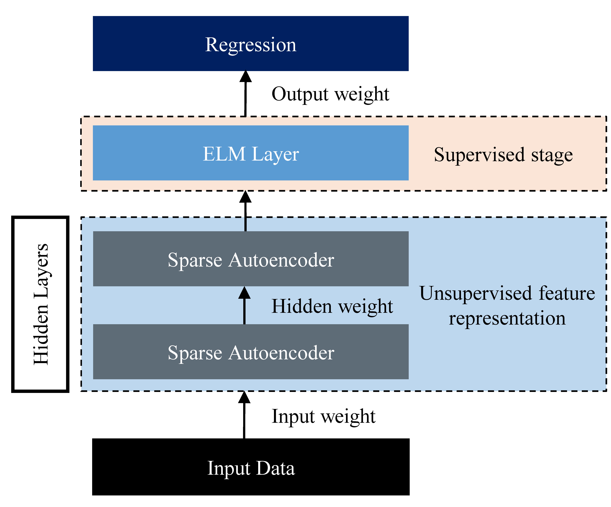
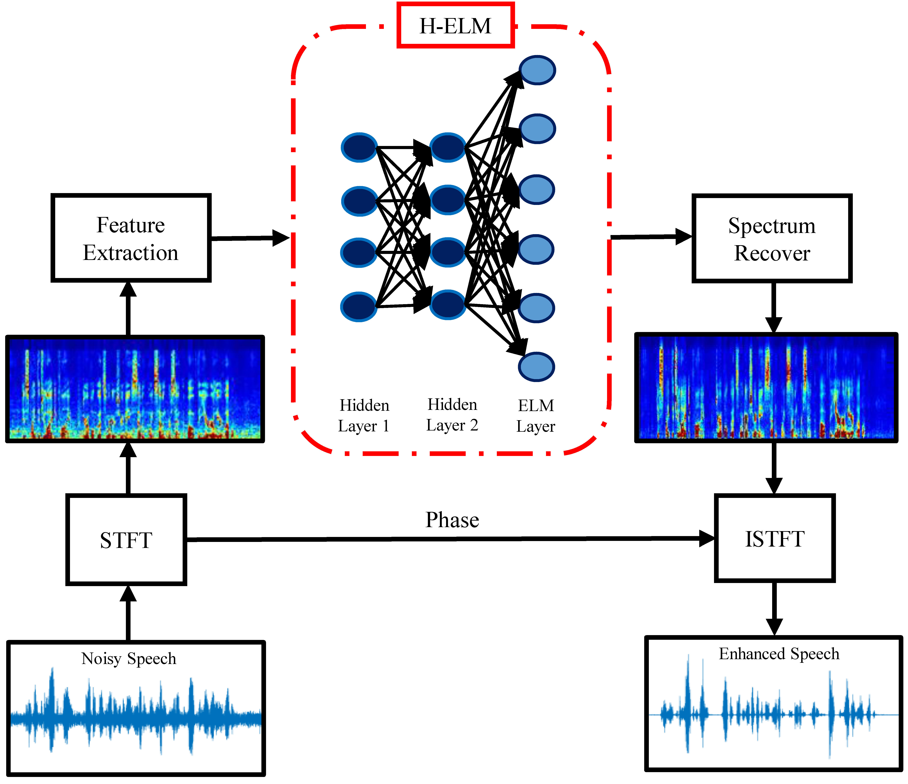

# Hierarchical Extreme Learning Machine for Speech Enhancement

The following GitHub repository contains the implementation of the extreme learning machine (ELM)- and hierarchical ELM (HELM)-based speech enhancement frameworks using MATLAB and python. In these experiments, ELM and HELM are used as a regression model to perform speech enhancement. The main concept is to use an ELM/HELM model to transform noisy speech to clean speech. The overall structure of the HELM model is illustrated in Fig. 1. 

The HELM framework comprises two stages, i.e., unsupervised feature extraction and supervised feature regression. In unsupervised feature extraction, high level features are extracted using an ELM-based autoencoder by considering each layer as an autonomous layer. The input data is projected to ELM feature space for feature extraction, in order to make use of information from training data. The output of the unsupervised feature extraction stage can then be used as the input to the supervised ELM regression stage for the final result, based on the learning from the two stages. For speech enhancement,  the noisy and clean speech signals are first converted into the frequency domain using the STFT to determine the frequency and phase components of the signal. The logarithm power spectra (LPS) of the noisy and clean speech spectra are then placed at the input and output sides of the ELM model, respectively. More specifically, the goal of the ELM/H-ELM system is to reconstruct the clean speech signal from the noisy speech by minimizing the reconstruction error. Fig. 2 illustrates the system architecture of the proposed ELM/HELM-based speech enhancement approach.

